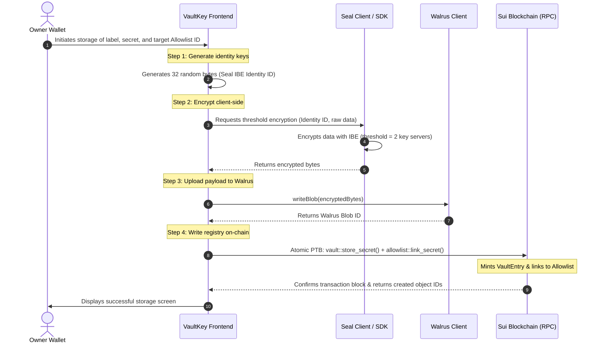
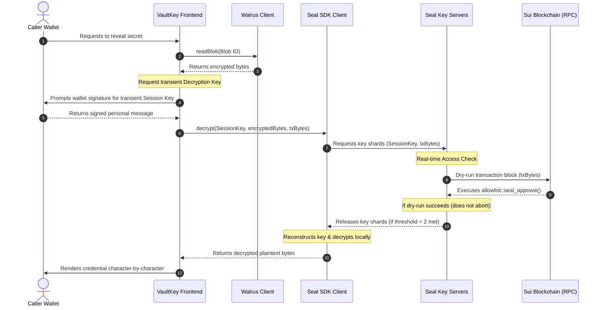

# VaultKey

VaultKey is a zero-infrastructure credentials manager built entirely upon a decentralised Web3 architecture. The application stores sensitive keys and credentials securely using a combination of the Sui blockchain, Walrus blob storage, and the Seal threshold cryptography protocol. No databases or central servers are required.

## Key Features

- **Decentralised Access Control**: Access policies are registered on-chain. Decryption keys are managed by a network of Seal key servers and are released only when on-chain dry-run transactions verify that the requester satisfies the policy.
- **Client-Side Encryption**: Credentials are encrypted locally using Identity-Based Encryption (IBE) before being distributed to Walrus storage. Plaintext secrets are never transmitted across the network or stored in database systems.
- **On-Chain Team Sharing**: Access rules can be scoped to shared teams. Team membership is tracked using dynamic fields on Sui objects, and members are automatically assigned TeamMembership objects to enable automatic team discovery.
- **Zero-Infrastructure Stack**: The application runs entirely client-side, eliminating server maintenance, database migrations, and administrative overhead.

---

## Technical Stack

- **Frontend**: Next.js 16 (App Router) styled with Tailwind CSS and Radix UI components.
- **Blockchain Layer**: Sui Network (Testnet) for managing access control states and team memberships.
- **Cryptography**: Seal SDK for threshold and Identity-Based Encryption.
- **Storage Layer**: Walrus Protocol for decentralised, redundant blob storage of encrypted payloads.

---

## Technical Flow

### Storing a Secret



### Decrypting a Secret



---

## Smart Contract Architecture

The smart contracts are written in Move and located under the `move/` directory. The package consists of four modules:

1. **`vault`**: Registers the core secret metadata (`VaultEntry` objects) and manages the creation of proof-of-ownership capabilities (`VaultCap` objects).
2. **`owner_policy`**: Verifies that the decryption requester is the original owner of the secret.
3. **`allowlist`**: Manages shared access lists, dynamic membership dynamic fields, and mints `TeamMembership` objects for team discovery.
4. **`timelock`**: Blocks decryption until a specified timestamp has passed.

---

## Getting Started

### Prerequisites

Ensure the following tools are installed:
- Node.js (v20.9.0 or higher)
- Bun
- Sui CLI (for compiling and deploying smart contracts)

### Installation

Install the package dependencies:
```bash
bun install
```

### Smart Contract Deployment

To publish the smart contracts to the Sui Testnet:

1. Navigate to the contract directory:
   ```bash
   cd move
   ```

2. Publish the package:
   ```bash
   sui client publish --gas-budget 150000000 --skip-dependency-verification
   ```

3. Copy the published package ID from the transaction output and update the `PACKAGE_ID` constant in `src/lib/vaultkey-sdk.ts`.

### Running the Application

Start the local development server:
```bash
bun run dev
```

Opening `http://localhost:3001` in a web browser loads the user interface.

### Production Build

To compile a production-optimised build of the application:
```bash
bun run build
```
